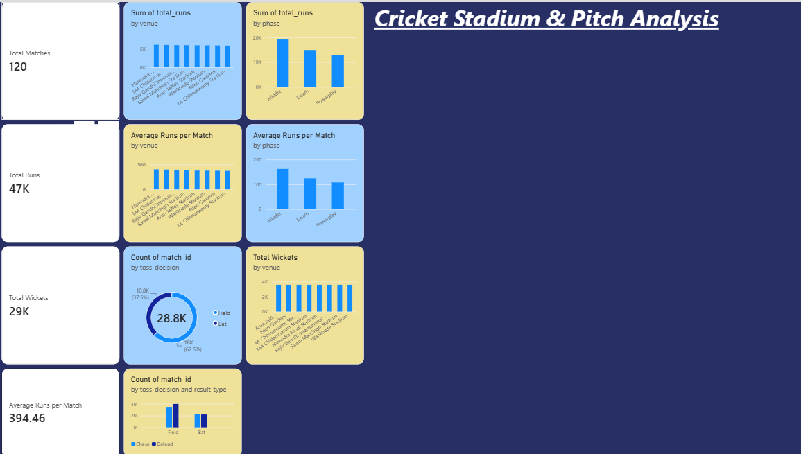
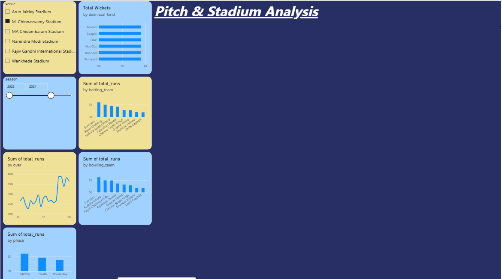
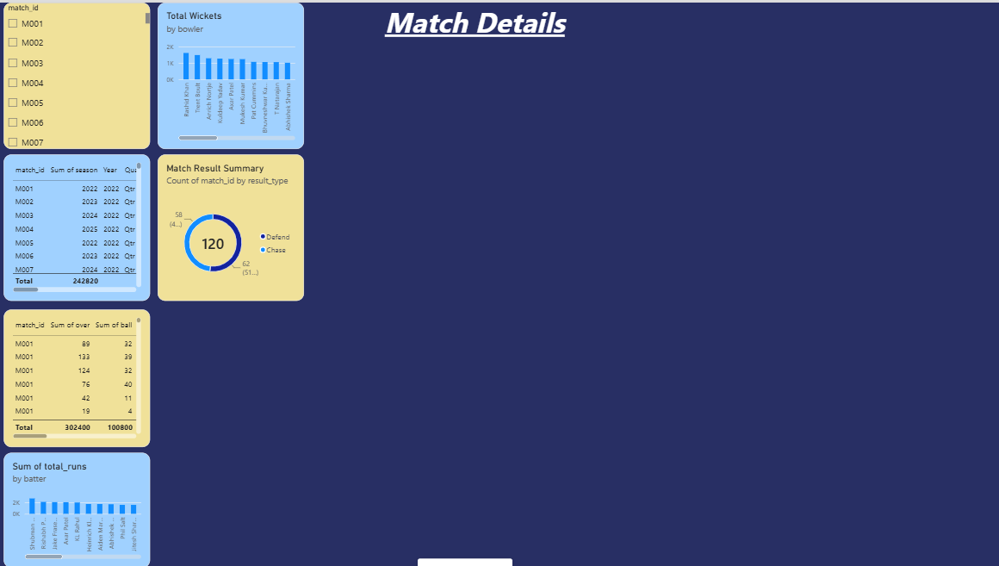

# 🏏 Cricket Stadium & Pitch Analysis – Power BI

## 📊 Project Overview

This project is an interactive Power BI dashboard designed to analyze cricket matches, stadium performance, pitch-related match patterns, batting, bowling, wickets, runs, toss decisions, and match results.

The dashboard helps understand how different venues and match situations affect cricket performance.

---

## 🎯 Objectives

- Analyze total matches and total runs
- Analyze wickets and average runs per match
- Compare performance across different venues
- Analyze runs by over and match phase
- Study toss decisions and match outcomes
- Analyze batting and bowling team performance
- Analyze wicket types
- Provide detailed match and ball-by-ball information

---

## 📁 Dataset

The project uses cricket match and ball-by-ball delivery data.

The dataset contains information such as:

- Match ID
- Season
- Date
- Venue
- Toss Winner
- Toss Decision
- Match Winner
- Result Type
- Batting Team
- Bowling Team
- Batter
- Bowler
- Over
- Ball
- Batsman Runs
- Total Runs
- Dismissal Type
- Match Phase

---

## 📈 Dashboard Pages

### Page 1 – Cricket Stadium & Pitch Analysis

The first page provides an overall summary of the cricket dataset.

**Visuals include:**
- Total Matches
- Total Runs
- Total Wickets
- Average Runs per Match
- Total Runs by Venue
- Average Runs by Venue
- Toss Decision Distribution
- Toss Decision vs Match Outcome
- Runs by Phase

---

### Page 2 – Pitch & Stadium Analysis

This page focuses on venue and match-performance analysis.

**Visuals include:**
- Venue Slicer
- Season Slicer
- Runs by Over
- Runs by Phase
- Wicket Types
- Runs by Batting Team
- Runs by Bowling Team

---

### Page 3 – Match Details

This page provides detailed match-level and ball-by-ball analysis.

**Visuals include:**
- Match ID Slicer
- Match Information Table
- Ball-by-Ball Details Table
- Runs by Batter
- Wickets by Bowler
- Match Result Summary

---

## 🛠️ Tools Used

- Microsoft Power BI
- Power Query
- DAX
- Excel / CSV Dataset
- GitHub

---

## 📌 Key Analysis Areas

### 🏟️ Stadium Analysis
Comparison of total and average runs across different cricket venues.

### 🏏 Batting Analysis
Analysis of runs scored by batters and batting teams.

### 🎯 Bowling Analysis
Analysis of wickets taken by bowlers and bowling teams.

### 🪙 Toss Analysis
Analysis of toss decisions and their relationship with match outcomes.

### 📊 Match Phase Analysis
Analysis of scoring patterns across different phases of the match.

### 📋 Match Details
Detailed match-level and ball-by-ball information.

---

## 📂 Project Files

The repository contains:

- Power BI Dashboard
- Dataset
- Project Documentation
- Screenshots

---

## 👩‍💻 Author

**Hardik Poojary**
---

## 📸 Dashboard Preview

### Page 1 – Cricket Stadium & Pitch Analysis

### Page 2 – Pitch & Stadium Analysis

### Page 3 – Match Details

---

## ⭐ Project
---

## 🔍 Key Insights

- The dashboard provides an overview of cricket match performance across different venues.
- Total runs and average runs can be compared across venues.
- Toss decisions can be analyzed against match outcomes.
- Run-scoring patterns can be studied across overs and match phases.
- Batting and bowling team performances can be compared.
- Wicket types and individual player performances can be explored.
- Match-level and ball-by-ball details are available for deeper analysis.

---

## 📊 Dashboard Features

- Interactive Venue and Season filters
- Match-level filtering
- Ball-by-ball analysis
- Venue-wise run analysis
- Batting and bowling analysis
- Toss and match-result analysis
- Wicket analysis
- Interactive Power BI visuals

---

## 📚 Skills Demonstrated

- Data Cleaning
- Data Modeling
- Power Query
- DAX Measures
- Data Visualization
- Dashboard Design
- Interactive Filtering
- Business/Data Analysis

 PROJECT STRUCTURE

cricket-stadium-pitch-analysis-powerbi
│
├── README.md
├── Cricket_Stadium_Pitch_Analysis.pbix
├── Cricket_Stadium_Pitch_Analysis_Data.xlsx
│
└── screenshots
    ├── dashboard-page-1.png
    ├── dashboard-page-2.png
    └── dashboard-page-3.png
This project was created as a Power BI data analytics project to demonstrate data visualization, dashboard design, data modeling, and DAX-based analysis.

p
